 

 

**A little less tab-hopping. A lot more focused practice.**

Quick links to verified problem pages and clearer progress highlights, right on your takeUforward A2Z sheet.

 

## What it adds

| Feature | What you get |
| --- | --- |
| **Practice links** | Direct GeeksforGeeks, LeetCode, and Coding Ninjas links beside questions when a verified match is available. |
| **Progress at a glance** | Completed sections are highlighted so finished topics are easier to spot. |
| **Your choice** | Turn quick links and completed-section styling on or off from the extension popup. |

Sheet Boost identifies questions using their takeUforward practice URL slug. It leaves a destination blank when it cannot verify a match instead of guessing. The bundled current sheet catalog has 402 question records. Its base catalog comes from [geckguy/striver-a2z-sheet](https://github.com/geckguy/striver-a2z-sheet).

## Install in Chrome

1. Download this project and unzip it if needed.
2. Open `chrome://extensions` and switch on **Developer mode**.
3. Choose **Load unpacked** and select the project folder containing `manifest.json`.
4. Open or refresh a takeUforward sheet. Use the extension popup to adjust the two settings.

To update an existing unpacked install, replace the project files, click the extension's reload icon on `chrome://extensions`, then refresh the sheet tab.

## Privacy

The extension requests only Chrome's `storage` permission and runs on takeuforward.org pages. Settings are stored with that permission; Sheet Boost does not require access to unrelated sites.

## Credits

The current A2Z sheet catalog is based on [geckguy/striver-a2z-sheet](https://github.com/geckguy/striver-a2z-sheet). Sheet Boost is an independent local extension inspired by TUF Enhancer.
